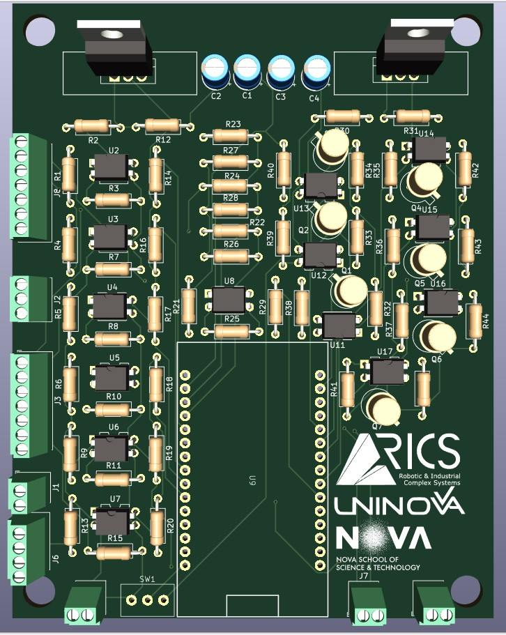

<div  align="center"> 

# Open Modular Controller for Automation Technologies
[](https://opensource.org/licenses/MIT)
[](https://doi.org/10.1109/ICPS59941.2024.10639979)

[Joao Potier](https://pt.linkedin.com/in/jo%C3%A3o-potier-5b1301228?trk=public_profile_samename-profile)<sup>1</sup>, 
[Miguel Arvana](https://scholar.google.com/citations?user=UBvr388AAAAJ&hl=pt-PT)<sup>1</sup>,
[Leandro Filipe](https://scholar.google.pt/citations?user=SoIohJwAAAAJ&hl=en)<sup>1</sup>,
[Fabio M-Oliveira](https://www.researchgate.net/profile/Fabio-M-Oliveira)<sup>1</sup>,
[Andre Rocha](https://scholar.google.pt/citations?user=k1GIyqcAAAAJ&hl=pt-PT)<sup>1</sup>,
[Jose Barata](https://scholar.google.pt/citations?user=4G8tKCsAAAAJ&hl=en)<sup>1</sup>

<sup>1</sup> **NOVA School of Science and Technology, Center of Technology and Systems (UNINOVA-CTS)**,
and Associated Lab of Intelligent Systems (LASI), NOVA University
Lisbon, 2829-516 Lisbon, Portugal


<table>
  <tr>
    <td style="vertical-align: top;">
      This work proposes the development of a controller, with modularity and flexibility as the core ideas, that allows for the integration of open-source standards like the proprietary technologies used in emergent factories and automation technologies. The implementation of this architecture led to the development of a prototype modular industrial controller that is, on average, a quarter of the cost of the new generation of industrial controllers. The developed controller was tested and validated using some educational kits.
    </td>
    <td style="vertical-align: top;">
      
    </td>
  </tr>
</table>

</div>

## Get Started
The following steps will help you guide in the repository, with the objective of having the necessary files to print the pcb and order the necessary components to make a functional board:
1. Find the [Gereber.zip](./docs/pcb/Gerbers.zip) and order (such as <https://jlcpcb.com/> or similar) or print your own pcb.
2. Have the components found in the [materials.csv](./docs/pcb/materials.csv).
3. Proceed the assembly of the pcb board, carefully assembly with the correct tools.
4. Teste the whole board for short circuits, bad weldings and voltage reach. We recomend using a multimeter for this step.
5. Assemble the ESP with the designated code and test each pin in isolation

If everything is good until, congratulations! You have a functional board!


### Usage instructions
After having a fully functional board and ESP, the usage of such device is straight forward. The ESP will control the input and output of each pin. Having a standard pin input/output voltage of 24v.<br>
These are control pins as such is not recomend to put on heavy current load.<br>
The code present in [testes](./tests/) present a good overview and tests made to this board, as well as the code and librarys in [code](./src/) show a first initial step to use the librarys and teste the board.

### Code Structure
```
open-modular-controller         
├── docs                # documentation
│   └── ...
├── imgs                # images
├── src                 # evaluation code
│   ├── ...                     # ...
└── tests               # tests
```
## Documentation

## Features

## Contribution Guidelines
NOVA RICS OPEN LAB open source, and we welcome contributions from the community! See the [Contribution](CONTRIBUTING.md) guide for more information on the development workflow and the internals of the wandb library. For project related bugs and feature requests, visit [GitHub Issues](https://github.com/NOVA-RICS-Open-Lab/open-modular-controller/issues) or contact novaricsopenlab@gmail.com

## Citation
If you use or intend to build on top of  the work in this repo, please consider citing our project:
```bibtex
@inproceedings{10639979,
  author={Potier, João and Arvana, Miguel and Filipe, Leandro and M-Oliveira, Fabio and Rocha, Andre Dionisio and Barata, Jose},
  booktitle={2024 IEEE 7th International Conference on Industrial Cyber-Physical Systems (ICPS)}, 
  title={Development of an Open, Modular Controller for Training in Emergent Automation Technologies}, 
  year={2024},
  doi={10.1109/ICPS59941.2024.10639979}
}
```

## License
This repository is released under the MIT License. Please see the [LICENSE](LICENSE) file for more details.

## Contacts
Contact us at novaricsopenlab@gmail.com
